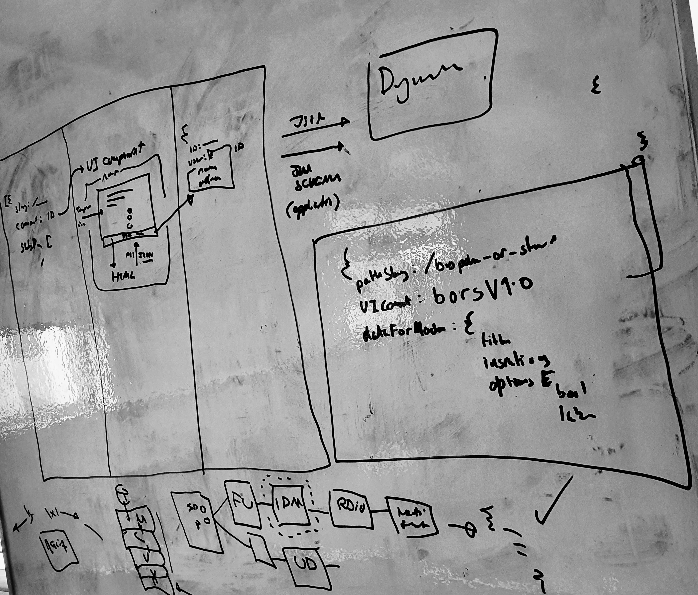

# Discussion of configuration driven screen UI and flow design

17/02/2020

## Problems

Currently various development tasks in the permits app are
cumbersome and expensive:

- creating new screens
- updating content in screens
- altering the flow between screens/steps in the application
  process
- testing the flows
- visualising the existing flows/structure
- identifying duplication and reuse (_how many times does this
  "type" of screen appear?_)
- unit and integration tests confused
- unable to integrate tools approaches from other teams or use
  parallel implementations of existing tools (e.g. some team can
  migrate between GDS tool kits)
- it shouldn't require the full development skill-set to make
  simple changes (could a UX designer make content and flow level changes?)

## Other Approaches

These problems are common to many teams with services on _*.gov.uk*_

Other teams have made attempts to tackle some of the above:

- [Defra digital-form-builder](https://github.com/DEFRA/digital-form-builder)
- [Hapi Simple GOV.UK Question Page](https://github.com/DEFRA/hapi-govuk-question-page)
- [hapi-front-end-template](https://github.com/ajaxscape/hapi-front-end-template)

Could we incorporate tools from other government teams (using a
similar/nodeJS stack?)

For example the
[MoJ Frontend](https://github.com/ministryofjustice/moj-frontend)
has many UX components we could make use of.

## Approach Discussed

The logic inside the application could be developed using a more
"configuration driven" approach.

- the flow between screens could be represented in its own data
  structure
- UI components/screens could conform to "contracts" (what
  data-structures/formats do they accept, what do they return)
- the collected data is stored and passed to other services
  according to another contract

We could reason about each "area of concern" independently, using
a JSON-Schema to define the inputs and outputs between each
area/domain:
```

routing         |                   |   persistence/storage
screen config   |   UI components   |   API contracts
flow            |                   |

```


