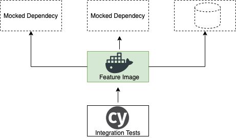

# Path to Production

## Tools

- Docker
- NodeJS
- AWS
  - S3
  - Either RDS or DocumentDB
  Containers
    - [ECS]() or Fargate
    - [ECR with Image Scanning](https://aws.amazon.com/blogs/containers/amazon-ecr-native-container-image-scanning/)
  - Cloud Front? How do we manage Load Balancing
- Jenkins
  - Docker installed (all processes run from containers)
  - Access to Docker Registry
  - Cypress.io for test suite

## Workflow

- Dev Environment/Work Flow
  - git repo (single repo to begin with)
  - all build/configure/test combinations can be run from local _Makefile_
  - Docker Containers
    - Node App
      - Live dev variant
      - Live unit test variant
      - Integration test variant
      - Functional test variant
    - DB
    - Mock S3
    - Cypress.io testing tools
- CI
  - container builds
  - unit test
  - integration test
  - functional test
- CD
  - _dev_ environment: can deploy and combination of available
    images (so could be reconfigured to take git-branch/feature
    images at press of button)
  - _QA_ takes dev images

### Feature Branches and Images

1. Developer creates a new feature branch
2. On push to git CI builds a relevant image (tagged to the
    branch-name, now used for automated testing and further
    developmet work)
3. The images is available for pull to local or other
   environments
4. Once marked `dev-complete` can be promoted to `dev` environment
   for QA, sign off, user testing etc...

### Developer Work Flow

1. Branch-image created (mirroring git branch)
   - sits on top of latest official node distro image
   - changes to node modules are infrequent so separeate
     layer/image used for this
   - source code makes up the final layer
   - this image is now tagged and can be deployed anywhere (most
     likely dev laptops and dev.sign-off env)
2. Local dev mounts their local file system into the container for
   live relaod, live-dev feedback loop
3. Tests are a further mount/layer
   - this way the feature image can be tested in isolation
   - we can separate test code and dependencies from release candidate
   - release candidate is always tagged and ready for
     - sharing
     - integration testing
     - review
     - deployment/promotion

### Testing Work Flow

- Unit test are executed as disposable layer during build
- From here on the tagged feature-image can be reused in multiple
  contexts with only configuration changes
- All CI tests (API, security, integration, functional and UI) can
  be run locally or in the cloud environments using the exact same
  components/images
- The CI runner only really needs docker/docker-compose and the
  relevant cloud CLI (this could be official containers too)

