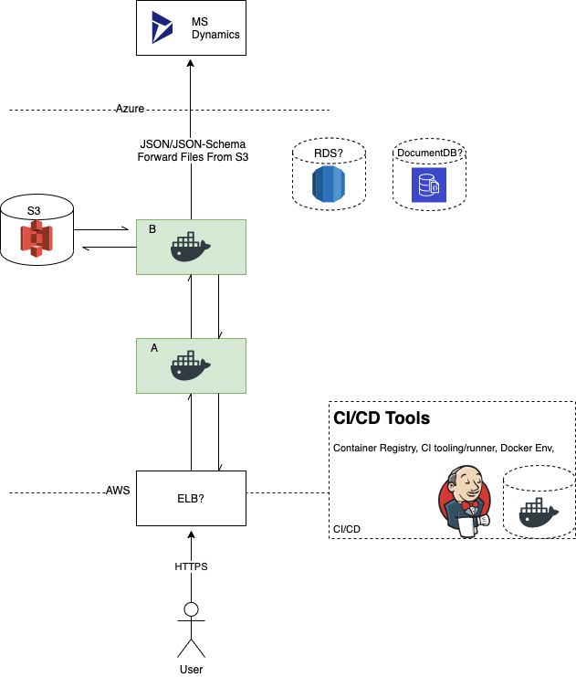

# Path to Production

- [Overview](#overview)
- [Tools](#tools)
- [Work Flow](#work-flow)
  - [Feature Branches and Images](feature-branches-and-images)
  - [Developer Work Flow](#developer-work-flow)
  - [Testing Work Flow](testing-work-flow)
  - [Environments](Environments)
    - [Possible Environment Layout](#possible-environment-layout)
- [Questions](#testing)

## Overview

As the proof of concept work makes use of a few different tools: our
infrastructure, work-flow and testing approach will change. This
requires support from outside the team so this document outlines
some of what we've got so far and where we'd like to be when this
approach goes into production.

## Tools

- Docker
- NodeJS
- AWS
  - S3
  - Either RDS or DocumentDB
  Containers
    - [ECS]() or Fargate
    - [ECR with Image Scanning](https://aws.amazon.com/blogs/containers/amazon-ecr-native-container-image-scanning/)
  - Cloud Front? How do we manage Load Balancing
- Jenkins/GitLab/Code Deploy/Whatever
  - Docker and Git installed (all processes run from containers)
  - Access to Docker Registry
  - Cypress.io for test suite

## Work Flow

- Dev Environment/Work Flow
  - git repo (single repo to begin with)
  - all build/configure/test combinations can be run from local _Makefile_
  - Docker Containers
    - Node App
      - Live dev variant
      - Live unit test variant
      - Integration test variant
      - Functional test variant
    - DB
    - Mock S3
    - Cypress.io testing tools
- CI
  - container builds
  - unit test
  - integration test
  - functional test
- CD
  - _dev_ environment: can deploy and combination of available
    images (so could be reconfigured to take git-branch/feature
    images at press of button)
  - _QA_ takes dev images

### Feature Branches and Images

1. Developer creates a new feature branch
2. On push to git CI builds a relevant image (tagged to the
    branch-name, now used for automated testing and further
    developmet work)
3. The images is available for pull to local or other
   environments
4. Once marked `dev-complete` can be promoted to `dev` environment
   for QA, sign off, user testing etc...

### Developer Work Flow

1. Branch-image created (mirroring git branch)
   - sits on top of latest official node distro image
   - changes to node modules are infrequent so separeate
     layer/image used for this
   - source code makes up the final layer
   - this image is now tagged and can be deployed anywhere (most
     likely dev laptops and dev.sign-off env)
2. Local dev mounts their local file system into the container for
   live relaod, live-dev feedback loop
3. Tests are a further mount/layer
   - this way the feature image can be tested in isolation
   - we can separate test code and dependencies from release candidate
   - release candidate is always tagged and ready for
     - sharing
     - integration testing
     - review
     - deployment/promotion

### Testing Work Flow

- Unit test are executed as disposable layer during build
- From here on the tagged feature-image can be reused in multiple
  contexts with only configuration changes
- All CI tests (API, security, integration, functional and UI) can
  be run locally or in the cloud environments using the exact same
  components/images
- The CI runner only really needs docker/docker-compose and the
  relevant cloud CLI (this could be official containers too)
- Test pyramid managed via cypress.io tooling

## Environments

1. Dev
   - images are built and unit tested per branch so this env picks
     an image up and runs it
   - can host any branch image and is easily switched between them
     (as it's simply the selection of a tagged image)
   - this is used for sharing work in progress with
     POs/designers/testers etc...
   - test cycle is launched any time an image is switched
   - configuration may select mocked components and data-stores
2. QA
   - Once `dev` candidates have been approved the branch is merged,
     the image is promoted/tagged for QA,
     the image _should_ be unchanged if correct work-flow is
     observed (otherwise error)
   - test suit runs against this environments configuration and
     equivalent data-store
3. Pre Production
   - image promoted/tagged
   - configuration applied
   - test suite run
4. Production
   - Same again

### Possible Environment Layout

The system is a simplification of its predecessors. The aim is to
have as few components as possible, deliver a basic MVP and ideally
adjust and develop incrementally. Therefore the layout below is
illustrative and due to the design of the system at a container
level is easy to reactor and reconfigure.

#### Container A

This container acts as the "front door" to the service. Its core
functionality consists of:

- housing static assets (CSS, images, file templates etc...)
- a Hapi web server serving HTML over HTTP to the load-balancer
- consumes configuration that determines the routes, screen
  definitions for UI and data collection
- provides error messages and health status
- does not have direct access to data-stores, down or up-stream
  services

#### Container B

This container acts as the conduit and insulation between container
A and data storage/ connected services. Its core functionality
consists of:

- connects directly to data-stores (S3 initially and databases
  should they added later on)
- passes the completed application to the downstream Dynamics CRM
  service in Azure
- data flows one way to CRM, both services share a JSON Schema
  contract (currently manged via a private Git repo, will ideally
  move to a shared Defra schema store)
- presents a simple REST JSON API to container A, enforcing its
  contracts via JSON Schema/OpenAPI

## Questions

- Which CI/CD and Cloud tools are available/supported?
- What is the preferred operation model between Web Ops and
  Developers?
- ???
